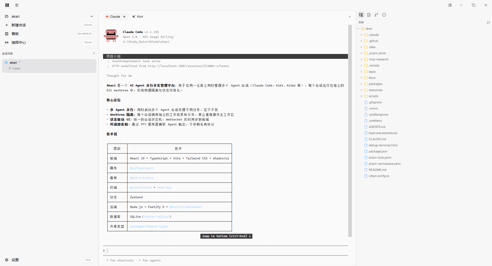

<p align="center">
  
</p>

<h1 align="center">Akari</h1>

<p align="center">
  AI Agent 并行化开发管理平台 —— 在独立的工作区中同时驱动多个 Agent，统一指挥、Review、合并。
</p>

<p align="center">
  <a href="https://github.com/chenzhen7/akari/releases"></a>
  <a href="./LICENSE"></a>
</p>

---

## 简介

Akari 是一个面向开发者团队的 **AI Agent 并行开发管理平台**。它基于 Git worktree 为每个会话创建完全隔离的工作区，让你能够同时启动多个 Agent（Claude Code、Kimi、Aider、Shell 等），通过统一界面查看状态、终端输出、代码 Diff，并在任务完成后统一 Review、合并回主干。

> 核心理念：你是指挥官，Agent 是并行执行的士兵。无限画布是战场全局视图，看板是任务状态流转，Tab 是快速聚焦单个战场，Worktree 是物理隔离的并行战线。

## 特性

- **多 Agent 并行**：Claude Code、Claude Orchestrator、Kimi、Aider、Shell 等多种 Agent 适配器
- **物理隔离**：每个会话拥有独立的 Git worktree，避免 Agent 之间互相污染
- **统一指挥中心**：广播消息、查看所有会话状态、批量推送指令
- **终端复用**：基于 node-pty 的终端多路复用，支持断线重连后回放输出
- **Git 原生集成**：分支管理、Diff 查看、合并策略选择（squash / merge / rebase）
- **实时同步**：WebSocket 长连接，状态、终端、Diff 实时同步到前端
- **桌面客户端**：基于 Electron 的 Windows 桌面应用，自带前后端一键启动

## 截图



## 快速开始

### 环境要求

- Node.js >= 24.15.0
- pnpm >= 11
- PowerShell 7（终端复用默认 Shell）
- Git
- VC++ Build Tools（Windows 下编译 node-pty 需要）

### 安装依赖

```bash
pnpm install
```

### 开发模式

同时启动前端和后端：

```bash
pnpm dev:all
```

前端地址：`http://localhost:5173`  
后端地址：`http://localhost:3001`

### 桌面端开发

```bash
pnpm dev:desktop
```

### 构建桌面安装包

```bash
pnpm build:desktop
```

构建产物位于 `apps/desktop/dist-electron/`，包含 NSIS 安装程序和便携版。

## 下载

访问 [Releases](https://github.com/chenzhen7/akari/releases) 页面下载最新版本的 Windows 安装包或便携版。

## 技术栈

| 层级 | 技术 |
|------|------|
| 前端 | React 19 + TypeScript + Vite + Tailwind CSS + shadcn/ui |
| 画布 | @xyflow/react |
| 看板 | @dnd-kit/core |
| 终端 | @xterm/xterm + node-pty |
| 后端 | Node.js + Fastify 5 + @fastify/websocket |
| 数据库 | SQLite + better-sqlite3 |
| 桌面 | Electron + electron-builder |
| 状态管理 | Zustand |

## 项目结构

```text
akari/
├── apps/
│   ├── desktop/        # Electron 桌面端
│   ├── server/         # Fastify 后端服务
│   └── web/            # React 前端
├── packages/
│   └── shared-types/   # 前后端共享类型
├── docs/               # 设计文档与开发计划
└── resources/
    └── server/         # 后端资源文件
```

## 支持的 Agent

| Agent | 标识 | 权限绕过 | 自动化 |
|-------|------|---------|--------|
| Claude Code | `claude` | ✅ | ✅ |
| Claude Orchestrator | `claude-orchestrator` | ✅ | ✅ |
| Kimi | `kimi` | ✅ | ✅ |
| Aider | `aider` | ❌ | ✅ |
| Shell | `shell` | ❌ | ❌ |

## 文档

- [状态变化机制](./docs/状态变化机制.md) — 基于 HTTP Hook 的状态流转机制
- [Claude Code Hook 参考](./docs/claude%20code%20%E7%9A%84hook%E5%8F%82%E8%80%83.md)
- [Electron 桌面端集成](./docs/electron-desktop-integration.md)
- [异常处理规范](./.claude/rules/error-handling.md)

## 参与贡献

欢迎 Issue 和 PR！

1. Fork 本仓库
2. 创建你的分支：`git checkout -b feature/foo`
3. 提交改动：`git commit -am 'feat: add foo'`
4. 推送分支：`git push origin feature/foo`
5. 提交 Pull Request

## 协议

[MIT](./LICENSE)
